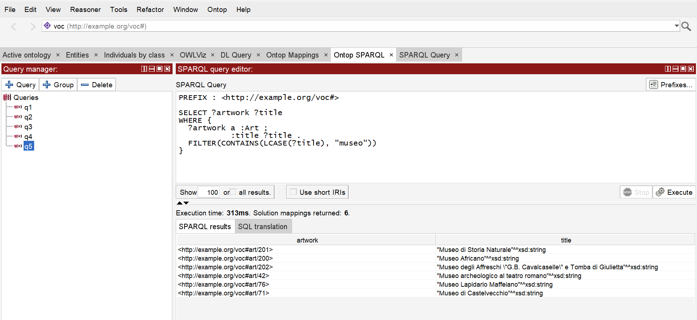
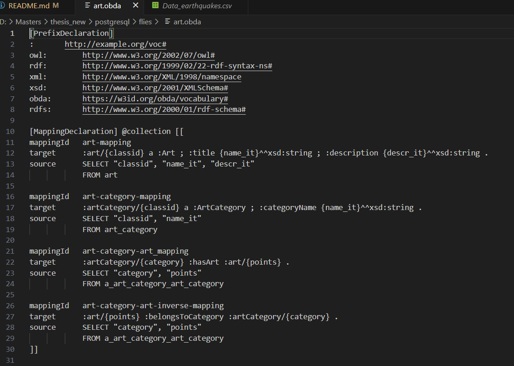
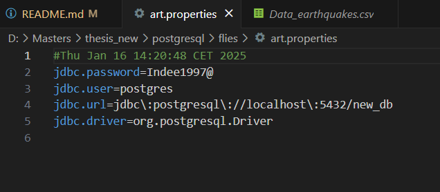
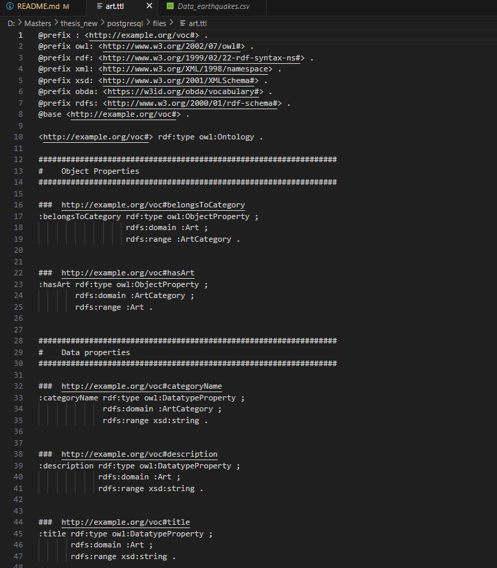
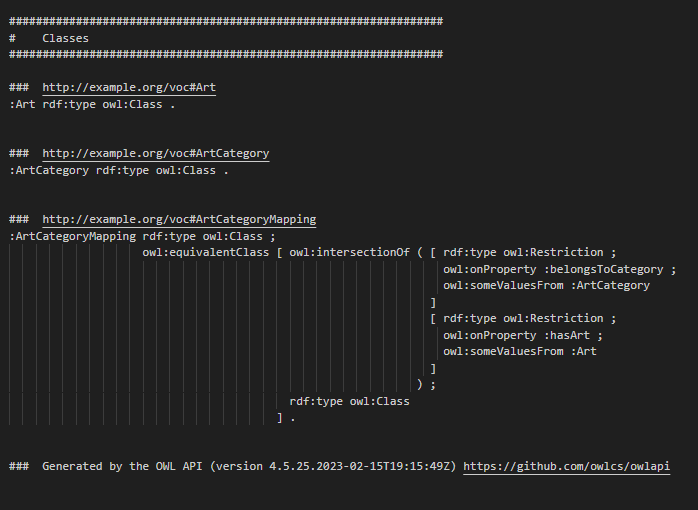

# 🔍 Ontology-Based Data Access with Ontop
## 📌 Project Overview
This repository documents my hands-on work with Ontop, an Ontology-Based Data Access (OBDA) tool that enables efficient SPARQL querying over relational databases. The focus is on setting up Ontop, defining mappings, and running queries on a database using PostgreSQL and DuckDB. (initially did with Ontop tutorial which used H2.)

💡 Check out their official tutorial to Ontop:
➡️ Ontop Getting Started Guide https://ontop-vkg.org/tutorial/basic/setup.html#database-setup 

🚀 Getting Started with Ontop
Ontop allows querying relational databases with SPARQL by mapping SQL data to RDF/OWL ontologies. Below, I outline how I set up Ontop with PostgreSQL and DuckDB.

## 1️⃣ Database Setup
You can use PostgreSQL or DuckDB as your relational database.

### Option A: PostgreSQL Setup
- Install PostgreSQL (Download)

- Start PostgreSQL and create a new database:

CREATE DATABASE new_db;
- Use (tourismdb_jan.backup)

- JDBC URL: jdbc:postgresql://localhost:5432/new_db
- Username: your_username
- Password: your_password

### Option B: DuckDB Setup
DuckDB is a fast, lightweight database optimized for analytical queries.

- Install DuckDB (Download)

- Open DuckDB and create a database:

- First tried creating tables manually and inserting then connect ontop(Data_earthquakes.csv)
- Then without manually creating, load the already exisisting dataset: duckdbDownload\new.duckdb - create database in duckdb(open cmd and type)

CREATE TABLE earth AS - load csv to table
    SELECT *
    FROM read_csv('path/to/your_file.csv');

- Save the database to a file (e.g., ontop.duckdb) and note the JDBC URL:

## 2️⃣ Connecting Ontop to the Database
Once the database is set up, Ontop needs to connect via JDBC.

### Steps in Protégé
- Open Protégé (Download here)
- Install the Ontop Plugin (if not already installed).
- Go to Ontop → New Ontop OBDA Model.
- Insert the JDBC Driver:
PostgreSQL: JDBC Driver
DuckDB: JDBC Driver
- Enter connection details:
PostgreSQL:
jdbc:postgresql://localhost:5432/ontop_db

DuckDB:
jdbc:duckdb:ontop.duckdb

### Test the connection to ensure everything works.
## 3️⃣ Loading the Ontology (.ttl file)
- Open your ontology file (.ttl) in Protégé.
- Ensure the ontology structure aligns with the database schema.
- Run a reasoner to check consistency.
## 4️⃣ Defining the OBDA Mappings
- Mappings define how relational data is translated into RDF triples.

- Go to Ontop Mappings in Protégé.

- Define mappings for the tables.

## 5️⃣ Running SPARQL Queries
- Once the mappings are set, now can query the database using SPARQL.
- Run the query in Ontop’s SPARQL Query Panel and inspect the results! 🎯

### 🛠️ Technologies Used
Ontop (OBDA framework)
Protege (Ontology Editor)
PostgreSQL & DuckDB (Databases)
SPARQL (Semantic query language)
JDBC Drivers (Database connectivity)

### 📌 Next Steps & Future Work
🔹 Explore reasoning and inference with Ontop
🔹 Test Ontop performance on large-scale datasets, that is the whole tourism dataset!

## 📖 Ontop Documentation
Check out the full documentation on Notion: [Click here](https://www.notion.so/Ontop-Bridging-Relational-Databases-and-Knowledge-Graphs-1af06666f81980f09493c8f677b5c4fd?pvs=4)

#### Below is the postgresql mapping,ttl and properties file. (memory issue!)

